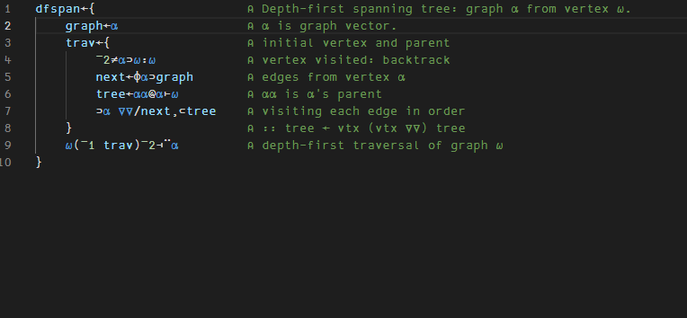
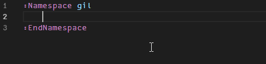

# APL Language Server Client

This extension implements the client for an APL Language Server. The server is embedded with the extension, but has its own repository on [APL Language Server](https://github.com/optimasystems/apl-language-server). Please report issues or feature requests to that project.

The language server requires a copy of Dyalog v17.0. Get your copy on [Download Dyalog](https://www.dyalog.com/download-zone.htm).

## Features

This Language Server works for apl files. It has the following language features:	

### Tool tips on primitives
								   


### Prefix completion

Prefix completion to simplify typing APL primitives without an IME.



## Configuration

This extension has the configuration options listed below:

```json
{
    "apl.server.executablePath": "dyalog.exe",
    "apl.server.maxWS": "4G",
    "apl.server.prefixCompleteCharacters": "`",
    "apl.server.wsPath": "/my/own/apl-language-server.dws",
    "apl.server.dyalogEnvVars": {}
}
```

The language server requires a copy of Dyalog v17.0. You can provide a path to the executable in `apl.server.executablePath` to ensure the correct version of Dyalog is used (if you have more than one).

You control the memory limit of the language server by setting `apl.server.maxWS` to a number followed by `[M|G]` (eg. 256M).

To change the character(s) used for prefix completion, set the `apl.server.prefixCompleteCharacters` to one or more characters.

The extension comes with an embedded copy of the [APL Language Server](https://github.com/optimasystems/apl-language-server). You can download a copy of the language server and then set the path to the dws in `apl.server.wsPath` to make use of an external language server.

## Copyright

The logo is Copyright © 2004 - 2018 Dyalog Ltd.